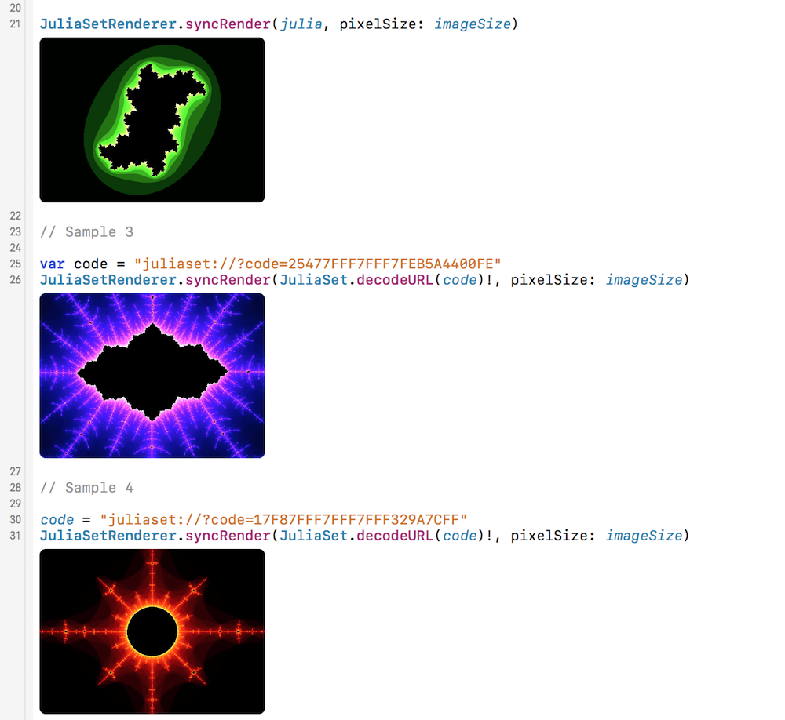
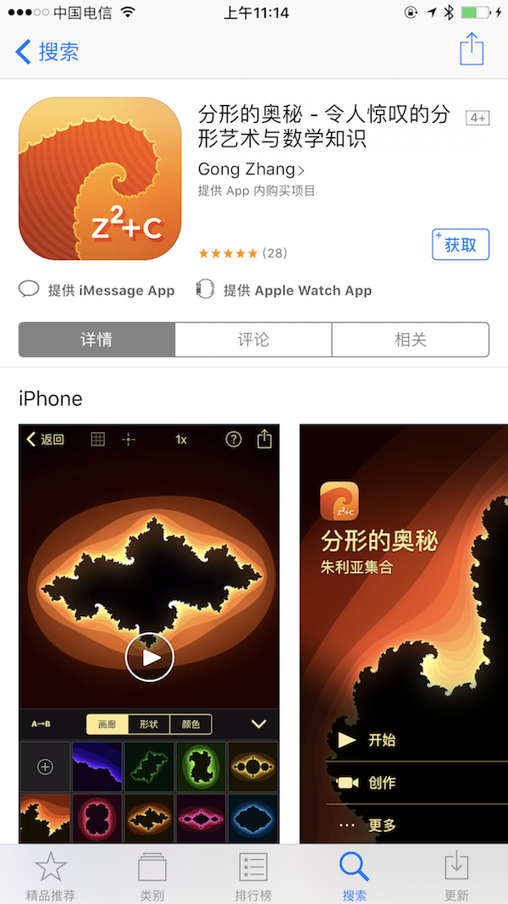

English | [中文](https://github.com/gongzhang/julia-set-playground/blob/master/README.zh-Hans.md)

# Julia Set Playground

This is an Xcode Playground that generates fractal images of the [Julia set](https://en.wikipedia.org/wiki/Julia_set).

The Julia set is a classic concept in fractal theory that generates stunning fractal images by means of an extremely simple formula.

```sh
z(n+1) = z(n)^2 + c
# where 'z' is a complex number 
```



You can use Xcode 13 to open `JuliaSet.playground`, and view the rendered image results on the right side of the window. The Playground contains all the source code inside.

Also, you may know of other kinds of fractals besides the Julia set, such as the [Mandelbrot set](https://en.wikipedia.org/wiki/Mandelbrot_set). With a simple modification of the code, you can draw it. You can try it yourself.

## About

I have a standalone app called "The Mysteries of Fractal". It generates dynamic fractal images in real time (based on Metal shader). The Mysteries of Fractal is a paid app for iOS / iPadOS / macOS. Welcome to experience it: [App Store Link](https://apps.apple.com/app/id1086527481).



## Sample Code

You can specify the formula parameters and observe how they affect the fractal image:

```swift
let imageSize = CGSize(width: 600, height: 440)
var julia = JuliaSet()

julia.window = 4.0
julia.const = Complex(-0.5, 0.0)
julia.color = JuliaSetColor(
    hue: 0,
    brightness: 0.87,
    saturation: 0.9
)

let outputImage = JuliaSetRenderer.syncRender(julia, pixelSize: imageSize)
```

You can also export a particular fractal from the Mysteries of Fractal app and draw it in Playground:

```swift
var code = "juliaset://?code=25477FFF7FFF7FEB5A4400FE"  // exported from app
let outputImage = JuliaSetRenderer.syncRender(JuliaSet.decodeURL(code)!, pixelSize: imageSize)
```

The render API supports asynchronous execution.

```swift
// render in background...
JuliaSetRenderer.asyncRender(julia, sizeInPixel: imageSize) { outputImage in
    // ...then get result in main thread
}
```

## More Mathematics Playground Projects

- 2D Image FFT: https://github.com/gongzhang/fft2d-swift-playground
- Fourier Expansion: https://github.com/gongzhang/swift-fourier-expansion
- Complex Number: https://github.com/gongzhang/swift-complex-number

## Contact

Feel free to contact me if you need more information ;)

Email: *gong@me.com*
