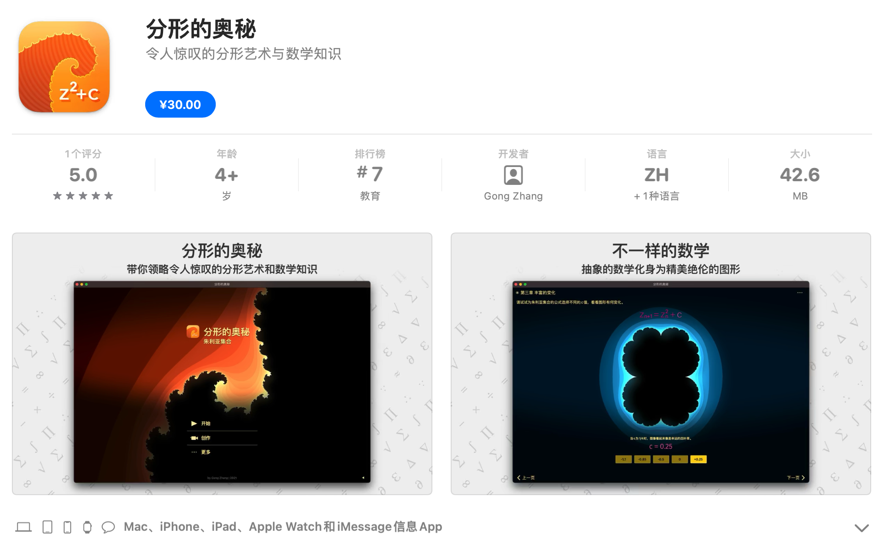

中文 ｜ [English](https://github.com/gongzhang/julia-set-playground/blob/master/README.md#julia-set-playground)

# 朱利亚集合 Playground

这是一个生成[朱利亚集合 (Julia Set)](https://zh.wikipedia.org/wiki/%E6%9C%B1%E5%88%A9%E4%BA%9A%E9%9B%86%E5%90%88)分形图像的 Xcode Playground 工程。

朱利亚集合是分形理论中的经典概念，它通过一个极为简单的公式来生成令人惊叹的分形图像：

```sh
z(n+1) = z(n)^2 + c
# 其中 z 是复数
```


你可以使用 Xcode 13 来打开 `JuliaSet.playground`，并在窗口右侧拾取和查看渲染的图像结果。Playground 里面包含了所有的源代码。

另外，你也许知道除了朱利亚集合以外的其他种类的分形，例如[曼德博集合](https://zh.wikipedia.org/zh-hans/%E6%9B%BC%E5%BE%B7%E5%8D%9A%E9%9B%86%E5%90%88)。只要对代码进行简单的修改，就可以绘制它了。你可以自己试试。

## 关于

我有一个独立应用作品“分形的奥秘”，它可以实时动态生成分形图像（是基于 Metal 实现的）。分形的奥秘是一个付费应用，支持 iOS / iPadOS / macOS，欢迎大家来体验：[App Store 连接](https://apps.apple.com/cn/app/id1086527481)。



另外，我还曾经和江苏卫视 *最强大脑* 节目组合作，共同打造了一期以分形数学为主题的挑战题目。节目现场使用了这个项目中的代码来生成题目。这期节目可以在爱奇艺网站观看：[最强大脑第4季2017-02-10](https://www.iqiyi.com/v_19rraqy0m8.html)。


> 江苏卫视「最强大脑」第四季，第 2017-2-10 期节目


## 样例代码

你可以指定公式参数，并观察它们如何影响分形图像：

```swift
let imageSize = CGSize(width: 600, height: 440)
var julia = JuliaSet()

julia.window = 4.0
julia.const = Complex(-0.5, 0.0)
julia.color = JuliaSetColor(
    hue: 0,
    brightness: 0.87,
    saturation: 0.9
)

let outputImage = JuliaSetRenderer.syncRender(julia, pixelSize: imageSize)
```

你也可以从分形的奥秘应用中导出某个特定的分形图，然后将它的代号放在 Playground 中绘制:

```swift
var code = "juliaset://?code=25477FFF7FFF7FEB5A4400FE"  // 从“分形的奥秘”中导出的一个分形
let outputImage = JuliaSetRenderer.syncRender(JuliaSet.decodeURL(code)!, pixelSize: imageSize)
```

渲染接口支持异步执行。

```swift
// 在后台渲染...
JuliaSetRenderer.asyncRender(julia, sizeInPixel: imageSize) { outputImage in
    // ...然后在主线程中获取结果
}
```

## 我的其他数学项目

- 二维图像 FFT: [fft2d-swift-playground](https://github.com/gongzhang/fft2d-swift-playground)
- 傅里叶级数展开: [swift-fourier-expansion](https://github.com/gongzhang/swift-fourier-expansion)
- 复数(虚数)运算: [swift-complex-number](https://github.com/gongzhang/swift-complex-number)

## 联系方式

- 领英: [linkedin.com/in/zhanggong](https://www.linkedin.com/in/zhanggong/)
- 邮件: [gong@me.com](mailto:gong@me.com)

***

# Julia Set Playground

This is an Xcode Playground that generates fractal images of the [Julia set](https://en.wikipedia.org/wiki/Julia_set).

The Julia set is a classic concept in fractal theory that generates stunning fractal images by means of an extremely simple formula.

```sh
z(n+1) = z(n)^2 + c
# where 'z' is a complex number 
```


You can use Xcode 13 to open `JuliaSet.playground`, and view the rendered image results on the right side of the window. The Playground contains all the source code inside.

Also, you may know of other kinds of fractals besides the Julia set, such as the [Mandelbrot set](https://en.wikipedia.org/wiki/Mandelbrot_set). With a simple modification of the code, you can draw it. You can try it yourself.

## About

I have a standalone app called "The Mysteries of Fractal". It generates dynamic fractal images in real time (based on Metal shader). The Mysteries of Fractal is a paid app for iOS / iPadOS / macOS. Welcome to experience it: [App Store Link](https://apps.apple.com/app/id1086527481).


## Sample Code

You can specify the formula parameters and observe how they affect the fractal image:

```swift
let imageSize = CGSize(width: 600, height: 440)
var julia = JuliaSet()

julia.window = 4.0
julia.const = Complex(-0.5, 0.0)
julia.color = JuliaSetColor(
    hue: 0,
    brightness: 0.87,
    saturation: 0.9
)

let outputImage = JuliaSetRenderer.syncRender(julia, pixelSize: imageSize)
```

You can also export a particular fractal from the Mysteries of Fractal app and draw it in Playground:

```swift
var code = "juliaset://?code=25477FFF7FFF7FEB5A4400FE"  // exported from app
let outputImage = JuliaSetRenderer.syncRender(JuliaSet.decodeURL(code)!, pixelSize: imageSize)
```

The render API supports asynchronous execution.

```swift
// render in background...
JuliaSetRenderer.asyncRender(julia, sizeInPixel: imageSize) { outputImage in
    // ...then get result in main thread
}
```

## More Mathematics Playground Projects

- 2D Image FFT: https://github.com/gongzhang/fft2d-swift-playground
- Fourier Expansion: https://github.com/gongzhang/swift-fourier-expansion
- Complex Number: https://github.com/gongzhang/swift-complex-number

## Contact

Feel free to contact me if you need more information ;)

Email: *gong@me.com*
